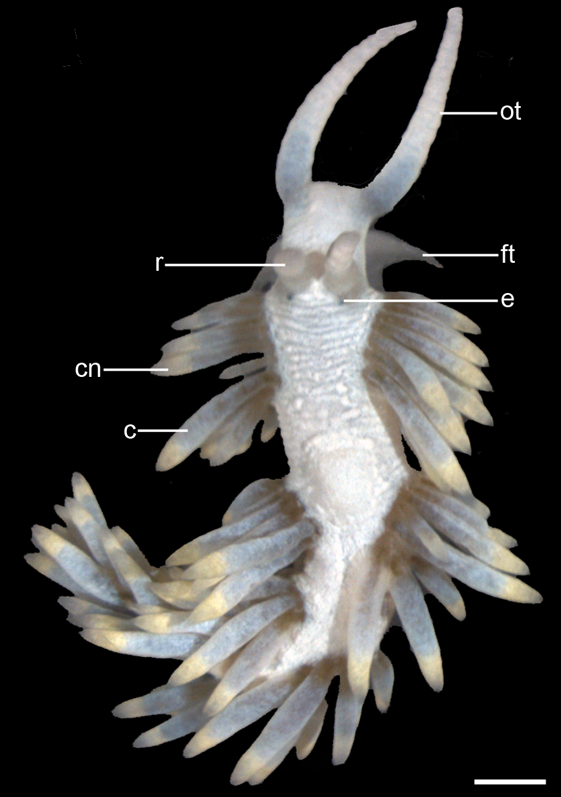
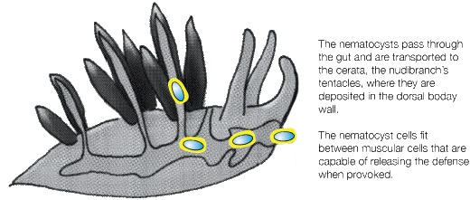
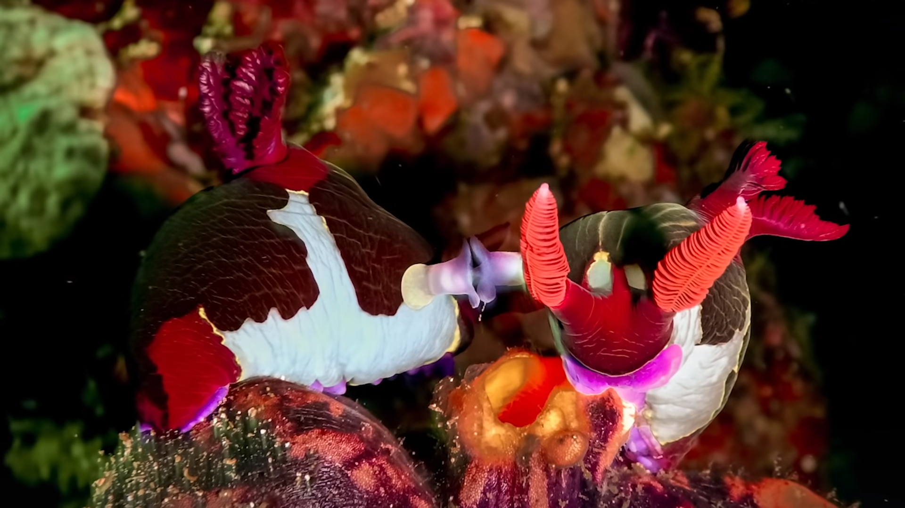
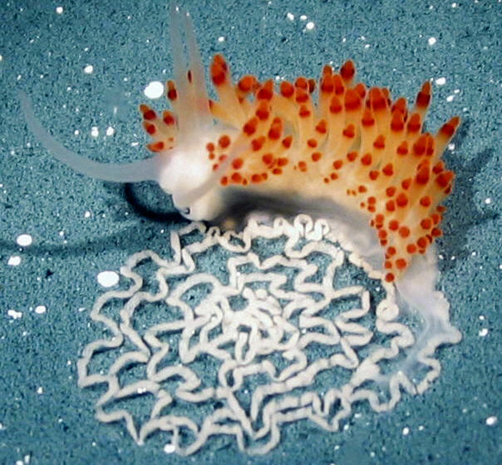

***
## Introduction


Nudibranchs are an order of benthic soft-bodied molluscs whose presence is easily betrayed by their fascinating but threatening color palette and uncanny eerie forms .They are more than **3000 species** of nudibranchs that crawl freely on the substrate of salty water bodies around the globe.

## Classification

Phylogenic level | Nudibranchs
-------------: | -------------
Kingdom: | *Animalia*
Phylum: | *Mollusca*
Class: | *Gastropoda*
Subclass: | *Heterobranchia*
Clade: | *Nudipleura*
Order: | *Nudibranchia*
  
The nudibranchs are usually divided in two main clades:

* **Dorids** (Anthobranchia) can be differentiated thanks to the presence of gills in the form of branchial feathers, which forms a sort of tuft on the posterior part of its body, all around the anus.

* **Aeolids** (Cladobranchia) have cerata (dispersed across the back) instead of branchial plumes. They lack a mantle (not just the cavity, both).

## General characteristics
As previously stated, the Nudibranchs are extremely diverse in shape, form, color and size. They show a remarkable diversity in multiple characteristics.
  
Nevertheless, here are some of the **universal features** found in almost every species of Nudibranchs:

* **Symmetry:**
    + External bilateral symmetry and internal **torsion**.
* **Anatomy:**
    + Lack of a **shell** and a **mantle cavity** (or even the mantle too for the Aeolids).
    + Simple digestive tube with a mouth, an anus and a **radula** (tongue with teeth).
    + Primitive **photosensitive** eyes.
    + Size varying from 4 to 600 mm.
    + Presence of **rhinophores** for odor detection and **cephalic/oral tentacles** which serve the functions of touch, taste and smell.
    + Presence of naked **gills** (plumes in a "rosette") near the anus on their back for breathing purposes.
* **Defense mechanisms:**
    + Presence of **ceratas** with **cnidosacs** on venomous species. There are a plethora of other defense mechanisms.
* **Reproduction:**
    + **Veliger larva** (with coiled shell, lost during metamorphosis and torsion).
    + **Hermaphrodite** sexual appendices (penis + vagina).

### Symmetry
Despite having an apparent bilateral symmetry (in opposition to most sea slugs), the reality is interestingly more complex. As a fact, during larval development, they undergo a process of **torsion**. That phenomenon can be explained as a **180° rotation of the visceral mass, mantle, and shell** concerning the head and foot of the gastropod.

But in this case, since the nudibranch is part of a class called Opisthobranchs (sea slugs), they undergo another secondary **partial**  detorsion, which results in the **inside of the Nudibranchs being torsionned** while the outside mostly is bilateral (aside from the sexual openings, which are located on the right side of the body).

### Anatomy



### Defense mechanisms
As seen on the previous illustration, the cnidosacs and ceratas have replaced the shell as defensive organs through evolutionary processes.




[^1]

There are other less common defenses such as **acidic mucus**, **distastefulness** and so on, but our understanding of these complex mechanisms is yet to be enlightened by new observations.

### Reproduction
Nudibranchs are **hermaphrodites**, which means they technically could pack it themselves. Except not really, because that would be too easy, innit? In order to mate, the nudibranch **follows the trail** and chemical signals (with the rhinophores) of other Nudibranchs of its species. 



The eggs are layed within a **gelatinous spiral** as shown below.  The **eggs contain toxins** from sponges to dissuade predators from having scrambled eggs for breakfast. In most species, the egg will hatch in a swimming **veliger larva** with a coiled shell, but the shell is lost during metamorphosis into the adult form. Young Nudibranchs look exactly like adults, but smaller and with fewer ceratas (for Aeolids). They can live from a few weeks to about a year depending on the species.



## Feeding process

The principal source of energy of the Nudibranchs are Sponges, hydroids, bryozoans, anemones, barnacles, tunicates, other sea slugs and even slugs of their own species. They are **strictly carnivorous**. 

## *Glaucus atlanticus*

Phylogenic level | Glaucus atlanticus
-------------: | -------------
Kingdom: | *Animalia*
Phylum: | *Mollusca*
Class: | *Gastropoda*
Superfamily: | *Aeolidioidea*
Family: | *Glaucidae*
Genus: | *Glaucus*
Species: | *G.atlanticus*

*Glaucus atlanticus* is a species of small, blue sea slug, a **pelagic aeolid nudibranch**, a shell-less gastropod mollusk in the family Glaucidae. It is known for being a **predator to the Portuguese man O'war** and for making use of **countershading** to thrive in hazardous.

For more information, check the species' wikipedia page ([link](https://en.wikipedia.org/wiki/Glaucus_atlanticus)).


[^1]: A similar process can be seen in a cousin group (Sacoglossan), where the sea slug **retains the chloroplasts** for their own photosynthetic use. This process is known as **kleptoplasty**.

<!---
Notes perso:
chunk
```{r}

```
--->
