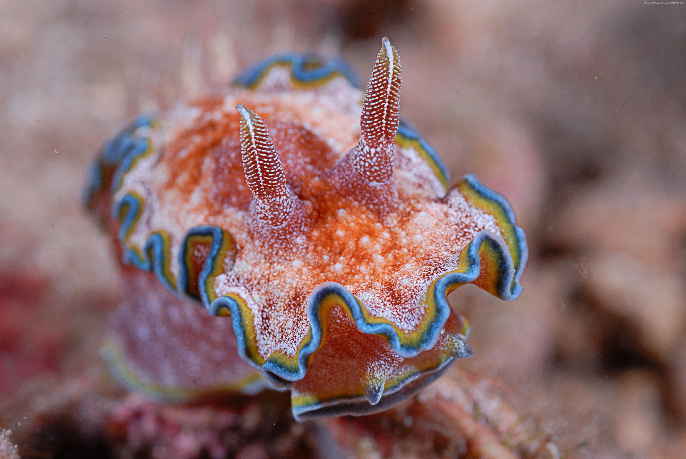

***

### Introduction
Nudibranchs are an order of benthic soft-bodied molluscs.They are often referred to as "sea rabbits" and are easily spottable a fascinating palette of colours


# Classification
**Kingdom:** Animalia 
**Phylum:** Mollusca 
**Class:** Gastropoda 
**Subclass:** Heterobranchia 
**Clade:** Nudipleura 
**Order:** Nudibranchia

```{r}

```


<!--- G.E.
Cette balise en grisée est une consigne. Il n'est pas utile de la supprimer. Elle ne s'affiche pas dans votre document finale. Afin de compiler votre document, cliquez sur le bouton `knit`

Vous trouverez ci-dessous un rappel des thématiques que vous pouvez inclure dans ce document :

- Classification
- Mode de vie
- Alimentation
- Reproduction
- ...
--->
